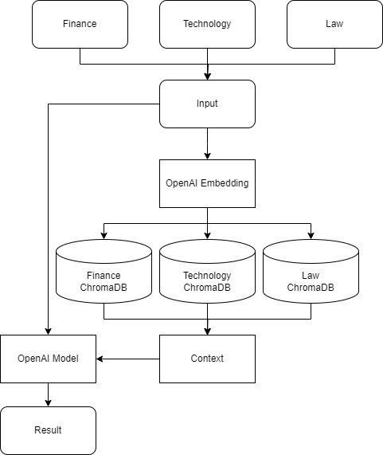

# FinanceBuddy

ChatBuddy is chatbot for Various Categories.

## Introduction 

- ChatBuddy is chatbot for finance, technology and law related details.
- It is manually trained on data in form of pdf books.
- It takes input from user and give response from available context of data.

## Pre-requisites

- Python >= 3.9
- OpenAI
- Langchain
- ChromaDB ==0.3.29
- Flask

## Workflow



## How to install and run project

- Clone github repository by manually [GitHub](https://github.com/pratikrathod08/ChatBuddy.git)

or

```bash
git clone https://github.com/pratikrathod08/ChatBuddy.git
```
- Create virtual environment 
```bash
⁠conda create -p <name> python == <version>
```
- Activate virtual environment
```bash
conda activate <name>
```
- Install dependencies
```bash
pip install requirements.txt
```
- Create a `.env` file in the root directory and add your OpenAI API key and Persist Directories name as follow:
```ini
OPENAI_API_KEY="****************************************************"
PERSIST_DIRECTORY_FINANCE="Vectors/Finance_DB"
PERSIST_DIRECTORY_TECHNOLOGY="Vectors/Technology_DB"
PERSIST_DIRECTORY_LAW="Vectors/Law_DB"
```
- Run project 
```bash
python app.py
```
- Open url and start Q&A with bot.

## Find a bug ?

If you found an issue or would like to submit an improvement to this project please submit and issue using the issue tab above. if you would like to submit a PR with a fix, reference the issue you created!

## Licence

[The MIT License (MIT)](LICENSE).


